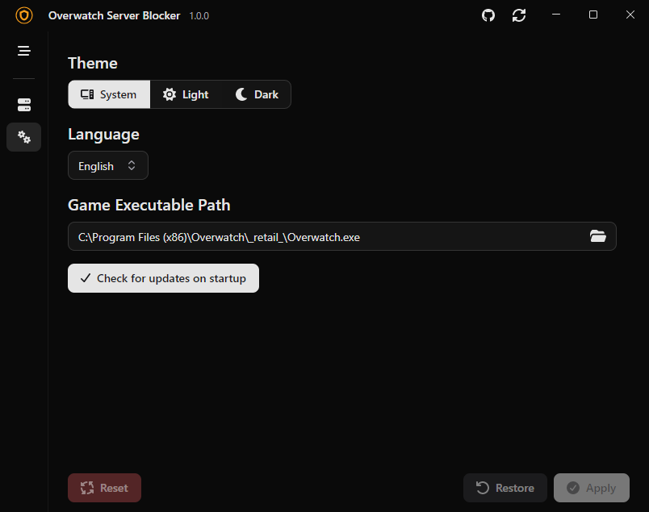

 

  

  <a href="https://FawazTakahji.github.io/OverwatchServerBlocker/"><h3 align="center">Overwatch Server Blocker</h3></a>

  

    An app that blocks Overwatch 2 from connecting to certain regions.
  

## How to use
1. Ensure that you have the [.NET 10](https://dotnet.microsoft.com/en-us/download/dotnet/10.0) runtime installed
2. Download the latest release from [here](https://github.com/FawazTakahji/OverwatchServerBlocker/releases)
3. Run the application
4. Select the regions you want to block
5. Click Apply
6. Launch Overwatch 2, you can close the application and the firewall rule will persist

## Safety
This application does not modify any game files, and does not inject any code into the game process. It simply modifies the firewall rules to block the servers from being accessed.

## Todo
- [ ] Create Linux version
- [ ] Create web app version
- [ ] Add Linux firewall support

## Screenshots

  
Home

  

  
Settings

  

